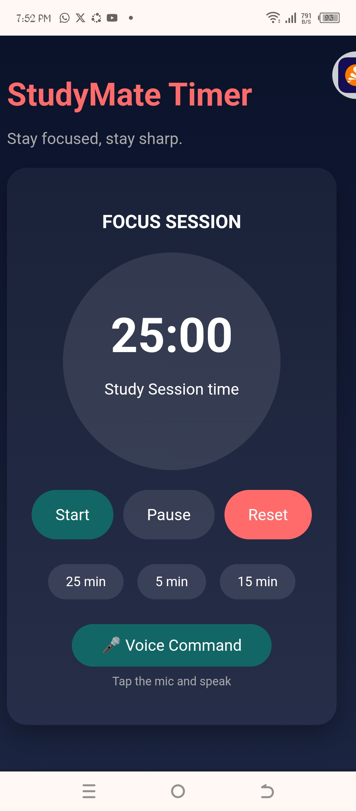

# ⏱ StudyMate Timer

A clean and responsive web‑based focus timer designed to help users stay productive using the Pomodoro technique. This simple yet powerful timer app features start, pause, and reset controls with an animated progress indicator — perfect for study sessions, work sprints, and time management practice.

🔗 **Live Demo:** https://study-mate-timer.vercel.app/

---

## 📌 Features

✨ **Start, Pause & Reset Controls**  
Easy timer control via buttons that feel intuitive and familiar.

🕒 **Animated Time Progress**  
A circular visual timer helps users stay aware of remaining focus time.

🎯 **Focus Support**  
Simple but effective tool to help structure work or study sessions.

📱 **Responsive Design**  
Looks great and works on both desktop and mobile devices.

🗣️ **Voice Command (Optional)**  
Supports simple voice commands to control the timer hands‑free.

---

## 🛠️ Built With

This project was built using:

- **HTML** – App structure and layout  
- **CSS** – Styling and visual design  
- **JavaScript** – Timer logic and interactivity  
- **Web Speech API** – Voice command support

---

## 🚀 How It Works

1. Click the **Start** button to begin a focus session  
2. Use **Pause** to temporarily stop the timer  
3. Click **Reset** to return the timer to its original value  
4. (Optional) Say commands like *“Start timer”* or *“Pause timer”* to control hands‑free

---

## 🧠 Why This Matters

Time management is one of the biggest challenges students, freelancers, and professionals face. StudyMate Timer provides a simple tool to structure time into focused sessions, helping users reduce procrastination, build consistency, and improve productivity.

---

## 📈 Potential Future Enhancements

Here are some features that could make this app even more powerful:

- 🔔 Sound or alert when time ends  
- 🌙 Dark/Light mode toggle  
- 📊 Session logs & daily statistics  
- 📝 Task management integration  
- 📦 Installable PWA version

---

## 📸 Screenshots

---

## 🏆 Built for DevCareer Hackathon

This project was created as part of the **DevCareer Hackathon**, demonstrating front‑end web development skills through a real productivity tool.

---

## 🙌 Acknowledgements

Thanks to **DevCareer** and **Raenest** for organizing the hackathon and supporting beginner developers!

---

## 📬 Contact Me

If you'd like to connect or collaborate, find me here:

- **GitHub:** https://github.com/your‑username  
- **Twitter/X:** https://twitter.com/your‑username  
- **LinkedIn:** https://linkedin.com/in/your‑profile
